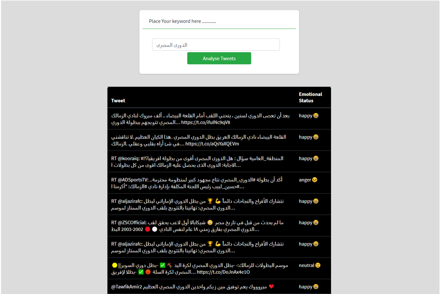
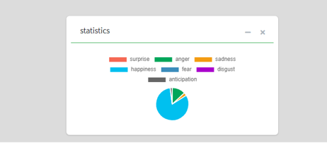

Since customers express their thoughts and feelings more openly than ever
before, Emotion analysis is becoming an essential to monitor and understand
these emotions.

Organizations need to focus on Customers convenience and to which limit they are
satisfied with the organization services. Automatically analyzing customer
feedback, such as opinion in survey responses, product reviews and social media
posts, comments, videos, and conversations, allows brands and service providers
to learn what makes customers happy or frustrated, so that they can tailor
products and services to meet their customers’ needs.

Therefor this project aims to automate the process of analyzing people opinion
and feedback about provided services and products from Twitter, the tweets of
customer about pacific topic is being analyzed to evaluate the satisfaction and
feelings of the customer.

The project applies Artificial intelligence techniques in classifying the
expressed emotions (anger, fear, disgust, happiness, neutral, Sadness and
surprise) and provide detailed description of their emotional status which is a
great interest to allow all brands and all service providers. By getting the
real feedback about services and improve it to meet people requirements as
possible which will lead also to an increase in profit.

 

